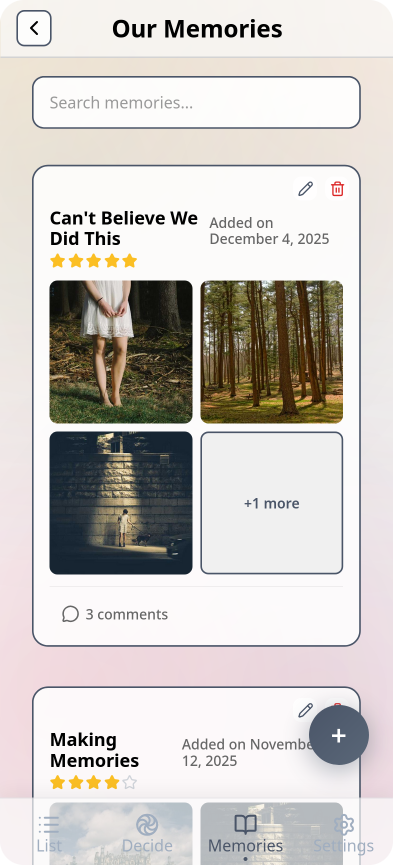

# Rendezvous!

## Online Demo

Try it out at [tryrendezvous.me](https://tryrendezvous.me)!

(For viewing pre-filled mock data, use username: Alice, password: password123)

  


## Description & Vision Statement

**Rendezvous** is a social planning app designed for university students and young adults who love going out with friends but struggle with the _“Where should we go?”_ dilemma. Instead of relying on endless group chats and scattered social media saves, Rendezvous offers a shared, centralized bucket list where friends can add cafes, restaurants, and activities they find online. When a user finds a new spot they like, they can add it directly into the app. The app then uses AI extraction tools to automatically pull key info such as name, cost, type of activity, etc.

When it’s time to hang out, users can:

- **View saved activities** and see an convenient, organised list of possible activities,
- **Let the app decide** through fun features like a wheel spin.
- **Record memories** by marking outings as done, and adding photos, captions and ratings.

<!--
Rendezvous is built to make social planning smoother, quicker, and more fun by helping friend groups spend less time deciding and more time experiencing.

Thus, it empowers groups of friends to effortlessly plan social outings by transforming indecisive group chats into an organized, collaborative experience.

Our vision is to make spontaneous hangouts exciting rather than stressful, by encouraging discovery of new places and creating lasting memories along the way.
-->

Our vision is to make spontaneous hangouts exciting rather than stressful, by helping friend groups spend less time deciding and more time experiencing.

## Core Team

| Name & GitHub                                        | Product Owner | Scrum Master |
| ---------------------------------------------------- | :-----------: | :----------: |
| [Catalin Botezat](https://github.com/CatalinMoldova) |   Sprint 2    |   Sprint 4   |
| [Deema Hazim](https://github.com/deema-hazim)        |   Sprint 3    |   Sprint 0   |
| [Nada Beltagui](https://github.com/nadsb26)          |   Sprint 0    |   Sprint 2   |
| [Nursultan Sagyntay](https://github.com/kazakhpunk)  |   Sprint 1    |   Sprint 3   |
| [Zavier Shaikh](https://github.com/zs-5)             |   Sprint 4    |   Sprint 1   |

## History

The idea for Rendezvous came from our own experiences as university students constantly trying to plan group outings. We noticed that group chats were full of “we should go here!” messages, but when the time came, no one could remember where or decide on a plan. This frustration inspired us to design a system that organizes shared ideas into a practical, fun tool for decision-making.

## Deployment

### Manual deploy to droplet
```bash
ssh root@YOUR_DROPLET_IP
cd /opt/app/4-final-random_sydneian
git pull origin <branch>
docker compose up -d --build
```

### CI/CD (GitHub Actions)
- Workflow file: `.github/workflows/custom-docker-deploy.yml`
- Triggers: push to `feat/custom-docker-deployment` (add branches in the workflow if you want more)
- On run, it SSHes to the droplet, pulls the branch, and runs `docker compose up -d --build`

Required repository secrets (Settings → Secrets and variables → Actions):
- `DROPLET_HOST` — droplet IP
- `DROPLET_USERNAME` — SSH user (e.g., `root`)
- `DROPLET_SSH_KEY` — private key (full BEGIN/END block)
- `DROPLET_PORT` — optional if not 22

### Docker notes
- Backend image uses `NODE_ENV=docker-production`
- Frontend build uses `VITE_DOCKER_PRODUCTION=true` to switch API calls to relative `/api/...`
- `docker-compose.yml` exposes frontend on port 80 and proxies `/api` to the backend service

## How to Contribute

More information on how to contribute can be found [here](CONTRIBUTING.md)!

## Local Setup Guide

### Initial setup

1. Clone the repo (and navigate into it):
   ```bash
   $ git clone https://github.com/agile-students-fall2025/4-final-random_sydneian.git
   $ cd 4-final-random_sydneian
   ```
1. Install the dependencies:
   ```bash
   $ (cd front-end && npm install) & (cd back-end && npm install)
   ```
1. Copy the `.env.template` file, rename to `.env`, and fill in the empty fields, for both the front-end and back-end directories (note, you will need to setup or obtain keys for external services, such as Google Maps, OpenAI, etc, but most importantly, MongoDB).
1. [Optional] To seed the database with mock data:
   ```bash
   $ cd back-end
   $ node --env-file .env seed-db.js
   ```
   This creates 5 users (all with password `password123`), 5 groups with overlapping memberships, 10 activities per group, and sample memories with images.

### How to Run

#### Front-End

1. Navigate to the front-end directory:
   ```bash
   $ cd front-end
   ```
1. Start the development server:
   ```bash
   $ npm run dev
   ```
   The app will be available at `http://localhost:3000` (or the port shown in the terminal).

#### Back-End

1. Navigate to the back-end directory:
   ```bash
   $ cd back-end
   ```
1. Start the development server:
   ```bash
   $ npm run dev
   ```
   The backend will be available at `http://localhost:8000` (or the port shown in the terminal).

### How to Test

1. Navigate to the back-end directory:
   ```bash
   $ cd back-end
   ```
1. Run the tests:

   ```bash
   $ npm test
   ```

   Or with coverage report:

   ```bash
   npm run test:coverage
   ```

### How to Build

#### Front-End

1. Navigate to the `front-end` directory:
   ```bash
   $ cd front-end
   ```
1. Build out the front-end:
   ```bash
   $ npm run build
   ```
1. You can now serve the static files in the dist directory. To preview them:
   ```bash
   $ npm run preview
   ```

#### Back-End

1. Navigate to the `back-end` directory:
   ```bash
   $ cd back-end
   ```
1. Add `NODE_ENV=production` (for local prod-like runs) to your .env:
   ```bash
   $ echo "NODE_ENV=production" >> .env
   ```
1. Run the app:
   ```bash
   $ npm start
   ```

### Notes

- Ensure you have Node.js (v18+) and npm installed.
- Ensure you have API keys / relevant setups for the following services:
  - MongoDB (connection string)
  - S3
  - OpenAI
  - Gmail (app password)
  - Google Maps

<!--
### Project Links

This repository will be used for team projects.

Several sets of instructions are included in this repository. They should each be treated as separate assignments with their own due dates and sets of requirements.

1. See the [App Map & Wireframes](instructions-0a-app-map-wireframes.md) and [Prototyping](./instructions-0b-prototyping.md) instructions for the requirements of the initial user experience design of the app.

1. Delete the contents of this file and replace with the contents of a proper README.md, as described in the [project setup instructions](./instructions-0c-project-setup.md)

1. See the [Sprint Planning instructions](instructions-0d-sprint-planning.md) for the requirements of Sprint Planning for each Sprint.

1. See the [Front-End Development instructions](./instructions-1-front-end.md) for the requirements of the initial Front-End Development.

1. See the [Back-End Development instructions](./instructions-2-back-end.md) for the requirements of the initial Back-End Development.

1. See the [Database Integration instructions](./instructions-3-database.md) for the requirements of integrating a database into the back-end.

1. See the [Deployment instructions](./instructions-4-deployment.md) for the requirements of deploying an app.
-->
